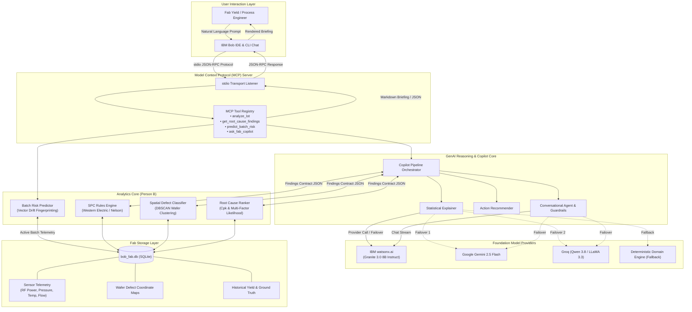

# 🏗️ Technical Architecture: FabGuard System Design

This document details the end-to-end technical architecture, component responsibilities, data flow, and integration pathways for **FabGuard**.

---

## 1. System Architecture Diagram

---

## 2. Component Responsibility Matrix

| Component | Technology | Primary Responsibility |
|---|---|---|
| **IBM Bob Interface** | IBM Bob IDE / Bob Shell | Provides native developer/engineer conversational workspace. Emits MCP JSON-RPC tool calls. |
| **MCP Server** | Python `mcp` SDK (2.x/1.x) | Exposes standard MCP tools over `stdio`, handling parameter deserialization and structured markdown output formatting. Strictly writes logs to `stderr`. |
| **Copilot Orchestrator** | Python (`copilot/pipeline.py`) | Coordinates calls between the analytics engine, explainer, recommender, and agent session state. |
| **Statistical Explainer** | Python (`copilot/explainer.py`) | Transforms quantitative deviations ($Z$-scores, Cpk drops, spatial clusters) into peer-to-peer technical briefings. |
| **Action Recommender** | Python (`copilot/recommender.py`) | Maps (step, parameter) findings to established fab standard operating procedures (tool PM, recipe requalification, sensor recalibration). |
| **Conversational Agent** | Python (`copilot/agent.py`) | Maintains multi-turn conversation context; enforces operational honesty rules and the mandatory DOE caveat. |
| **watsonx.ai Granite** | `ibm-watsonx-ai` SDK | Primary enterprise foundation model (`ibm/granite-3-8b-instruct`) providing high-precision semiconductor technical reasoning. |
| **Analytics Core** | NumPy, SciPy, Scikit-learn | Executes Western Electric SPC rules, DBSCAN spatial clustering on wafer defect coordinates, and multi-factor Bayesian attribution. |
| **Data Repository** | SQLite3 (`bob_fab.db`) | Relational fab database containing lots, equipment, steps, sensor logs, wafer inspection coordinates, and ground truth labels. |

---

## 3. End-to-End Data Flow

1. **Tool Invocation**:
   When a user in IBM Bob types `@bob analyze LOT-2231`, Bob inspects its MCP server registry and dispatches a JSON-RPC `tools/call` message for `analyze_lot` with arguments `{"lot_id": "LOT-2231"}` to `src/mcp_server.py`.
2. **Analytics Ingestion & Feature Extraction**:
   - `analytics.pipeline.analyze_lot` queries `bob_fab.db` for all process steps, sensor measurements, and defect coordinates associated with `LOT-2231`.
   - `analytics.spc` checks parameters against control limits ($UCL$, $LCL$) and historical sigma baselines.
   - `analytics.spatial` clusters inspection coordinates using DBSCAN to identify geometric defect signatures (e.g. edge-ring, center-cluster).
   - `analytics.root_cause` calculates capability index degradation ($\Delta C_{pk}$) and p-values to score candidate causes.
3. **LLM Synthesis & Guardrail Enforcement**:
   - The analytics findings are serialized into structured JSON conforming to the contract schema.
   - `copilot.explainer` prompts `ibm-watsonx-ai` Granite 3.0 to formulate a technical explanation adhering strictly to statistical confidence rules (only calibrated models report "probability").
   - `copilot.recommender` injects hard-coded domain SOP actions.
   - The mandatory DOE caveat is automatically appended: *"Recommend confirming via targeted DOE before taking corrective action."*
4. **Response Delivery**:
   The briefing is formatted into rich GitHub-flavored markdown and returned over `stdio` to IBM Bob, which displays the interactive report directly in the chat panel.

---

## 4. Security, Resilience & Scalability Notes

- **Credential Hygiene**: API keys (`WATSONX_API_KEY`, `GEMINI_API_KEY`, `GROQ_API_KEY`) are managed strictly via environment variables (`.env`) which are excluded in `.gitignore`.
- **Fault-Tolerant Provider Failover**: If watsonx or Gemini encounters rate limiting (HTTP 429), the system automatically falls back to Groq or deterministic domain templates without halting fab operations.
- **STDIO Purity**: All MCP server debug messages and runtime traces write strictly to `sys.stderr`, preventing corruption of standard JSON-RPC data streams.
- **Stateless MCP Execution**: Tools are designed to be idempotent and thread-safe, allowing horizontal scaling across multiple tool-calling instances.
